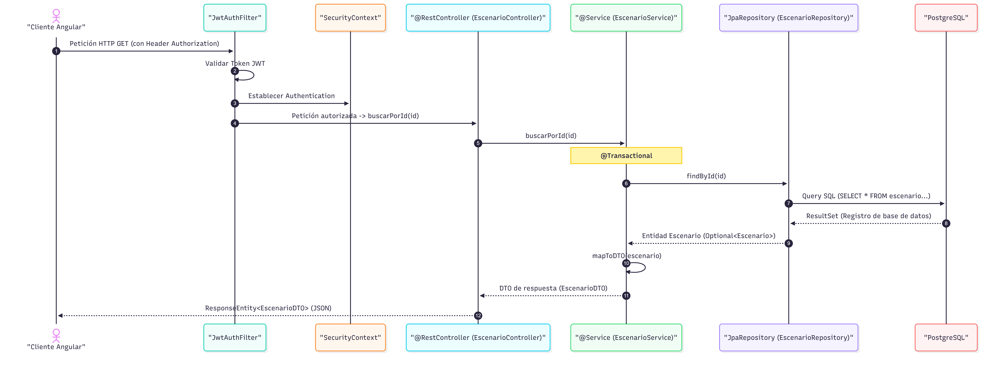

# Simulador de Comportamiento Vial con Inteligencia Artificial (SBVIA)

## Descripción del Proyecto
El sistema Simulador de Comportamiento Vial con Inteligencia Artificial (SBVIA) proporciona un entorno de entrenamiento y evaluación para conductores en formación. Esta entrega implementa el módulo de autenticación JWT y el CRUD de escenarios usando Spring Boot y Angular.

## Instrucciones de Ejecución (Entrega 1B)

El sistema completo (Backend, Frontend, Base de datos y Cache) está orquestado con Docker Compose. **Sigue estos 5 pasos para arrancar la aplicación:**

### 1. Clonar el repositorio y cambiar a la rama de entrega
```bash
git clone https://github.com/keithdrox/SBVIA-AppWeb.git
cd SBVIA-AppWeb
git checkout entrega-1b
```

### 2. Copiar variables de entorno
```bash
cp .env.example .env
```
*(Editar `.env` con las credenciales si es necesario, los valores por defecto funcionan localmente)*

### Credenciales de Administrador por Defecto
El sistema arranca con un usuario administrador pre-configurado en `db/seed.sql`:
- **Email:** admin@sbvia.com
- **Contraseña:** admin123


### 3. Levantar todos los servicios
```bash
docker compose up --build -d
```

### 4. Verificar que todos los servicios están en estado "healthy"
```bash
docker compose ps
```

### 5. Acceder a la aplicación
- **Frontend Angular:** [http://localhost:4200](http://localhost:4200)
- **Swagger UI (Backend API):** [http://localhost:8080/api/swagger-ui.html](http://localhost:8080/api/swagger-ui.html)
- **Actuator Health:** [http://localhost:8080/actuator/health](http://localhost:8080/actuator/health)

---
### Ejecutar pruebas (sin Docker)
```bash
cd backend
./mvnw test
```
*(En Windows puedes usar `mvnw.cmd test`)*

---
## Flujo MVC de Petición Autenticada en Spring Boot
**Actividad preparatoria para la Práctica Experimental de la Unidad IV.**



### Descripción de cada paso del flujo:
1. **Cliente Angular -> JwtAuthFilter**: El cliente envía una petición `GET /api/escenarios/1` con el token JWT en el Header `Authorization`.
2. **JwtAuthFilter (Validación)**: El filtro intercepta la petición y valida la integridad y firma del Token JWT.
3. **JwtAuthFilter -> SecurityContext**: Al ser válido, extrae la identidad del usuario y establece la `Authentication` en el `SecurityContext` de Spring.
4. **JwtAuthFilter -> EscenarioController**: La petición pasa al `DispatcherServlet` que la enruta al `@RestController` `EscenarioController`, método `buscarPorId(id)`.
5. **EscenarioController -> EscenarioService**: El controlador delega la lógica de negocio al `@Service` `EscenarioService` llamando a su método homónimo.
6. **EscenarioService (@Transactional)**: Se inicia una transacción de base de datos, en este caso optimizada para lectura (`readOnly = true`).
7. **EscenarioService -> EscenarioRepository**: El servicio invoca a la interfaz `JpaRepository` (`EscenarioRepository`) usando el método `findById(id)`.
8. **EscenarioRepository -> PostgreSQL**: Hibernate/Spring Data traduce el llamado a una query SQL `SELECT` y la ejecuta en la BD.
9. **PostgreSQL -> EscenarioRepository**: La BD devuelve el `ResultSet` que JPA mapea a la entidad relacional `Escenario`.
10. **EscenarioRepository -> EscenarioService**: El repositorio retorna un `Optional<Escenario>` a la capa de servicio.
11. **Mapeo a DTO**: El servicio mapea la entidad `Escenario` recuperada a un objeto `EscenarioDTO` (Data Transfer Object).
12. **EscenarioService -> EscenarioController**: El servicio finaliza la transacción y retorna el `EscenarioDTO` al controlador.
13. **EscenarioController -> Cliente Angular**: Spring serializa el DTO a JSON dentro de un `ResponseEntity` (HTTP 200 OK) y lo responde al cliente.
