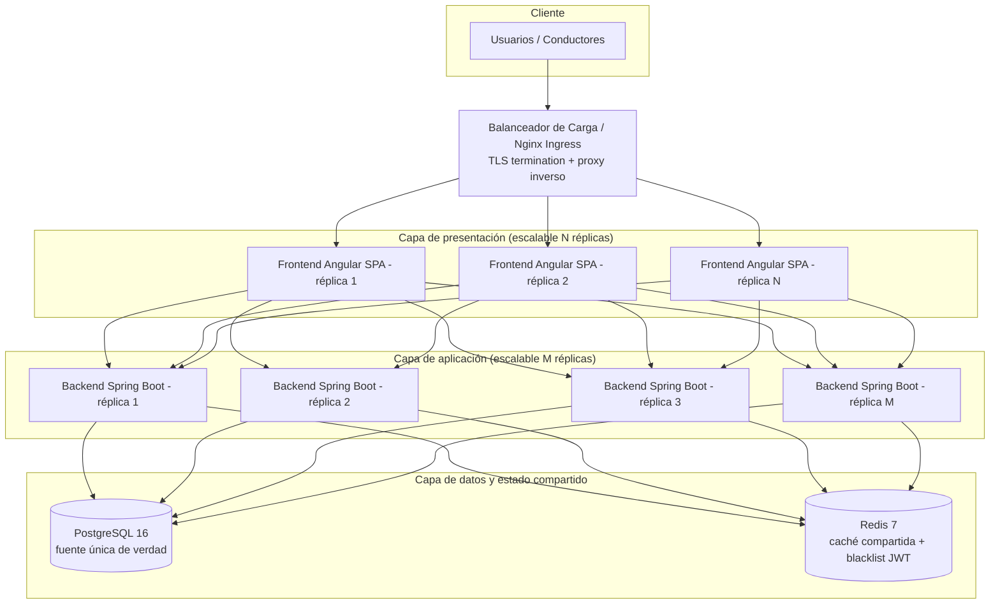

# Análisis de Escalabilidad Horizontal

**Proyecto:** SBVIA - Simulador de Comportamiento Vial con IA
**Criterio:** C9 - Escalabilidad horizontal (rúbrica de la Entrega Final)
**Estado:** Documentado y verificado contra la arquitectura desplegada (ADR-007)

---

## 1. Contexto

La aplicación SBVIA está compuesta por un frontend Angular (SPA estática), un backend Spring Boot 3.2 / Java 21, una base de datos PostgreSQL 16 y una caché Redis 7. Cuando la demanda crece (más conductores en formación concurrentes realizando simulaciones), un despliegue de un único contenedor por servicio se convierte en un punto de contención. Este documento analiza cómo escalar horizontalmente (añadiendo réplicas en lugar de más recursos a un solo nodo) cada capa, y qué decisiones arquitectónicas ya tomadas lo habilitan.

La escalabilidad de SBVIA se apoya en tres propiedades ya presentes en el código:

1. **Backend sin estado (stateless)** gracias a la autenticación JWT con cookie `HttpOnly` (ADR-003). No se almacena la sesión en memoria del servidor, por lo que cualquier réplica del backend puede servir cualquier petición.
2. **Caché y revocación de tokens centralizadas en Redis** (ADR-003, ADR-004). La blacklist JWT y la caché de escenarios viven en Redis, no en la memoria de un contenedor, de modo que todas las réplicas comparten el mismo estado transitorio.
3. **Contenedores reproducibles vía Docker Compose** (ADR-007), que permiten instanciar N réplicas idénticas detrás de un proxy inverso.

---

## 2. Diagrama de Escalabilidad Horizontal



**Nota de lectura:** Cualquier réplica del backend (`B1`, `B2`, `B3`, … `Bm`) puede atender cualquier petición de cualquier réplica del frontend, porque el estado de autenticación vive en el token JWT (cookie) y el estado transitorio de caché/revocación vive en Redis. El único estado que no se replica es la base de datos relacional, que permanece como punto único de persistencia (ver sección 4).

---

## 3. Estrategia por Capa

### 3.1. Capa de presentación (frontend Angular)

- El frontend es una SPA 100% estática servida por Nginx. Al no guardar estado propio, escalar horizontalmente solo requiere servir la misma build desde más réplicas de Nginx detrás del balanceador.
- El balanceo por **cookies o IP hash** no es necesario: al ser estático, cualquier réplica sirve el mismo contenido.
- **Límite práctico:** la capacidad de conexiones abiertas (WebSocket/SSE si se usaran) y el ancho de banda estático.

### 3.2. Capa de aplicación (backend Spring Boot)

- El backend es **stateless** (JWT en cookie `HttpOnly`, sin `HttpSession` en memoria). Esto permite escalar a **M réplicas idénticas** sin afinidad de sesión (sticky sessions).
- Cualquier réplica puede validar el JWT: la clave de firma `JWT_SECRET` es compartida por todos los contenedores vía variables de entorno (ADR-007), y cada una verifica firma, emisor y audiencia de forma independiente.
- La **revocación de tokens** (logout) se centraliza en Redis a través de la blacklist (`TokenBlacklistService`). Como todas las réplicas consultan el mismo Redis, un token revocado a través de la réplica 1 también es rechazado por las réplicas 2 y 3.
- La **caché de listados** (`@Cacheable` en `EscenarioService`) también se centraliza en Redis (`CacheConfig`), por lo que todas las réplicas comparten la misma caché y la invalidación (`@CacheEvict`) propagada desde cualquier réplica es visible para las demás.

### 3.3. Capa de datos (PostgreSQL) y estado compartido (Redis)

- **Redis** es el habilitador clave de la escalabilidad horizontal del backend: al centralizar caché y blacklist, evita que las réplicas tengan estado divergente en memoria.
- **PostgreSQL** es la fuente única de verdad. La escalabilidad horizontal de la capa de escritura no se aborda con réplicas de aplicación sino con:
  - **Pool de conexiones** (PgBouncer) para absorber el aumento de conexiones de M réplicas.
  - **Réplicas de lectura** para descargar las consultas de reportes/lectura (los SP `sp_reporte_*` y `sp_calcular_promedio_usuario` son operaciones de lectura ideales para enrutarse a réplicas).

---

## 4. Cómo escala cada propiedad y sus límites

| Propiedad | Cómo escala | Dónde se replica | Límite |
|---|---|---|---|
| Autenticación (JWT cookie `HttpOnly`) | Stateless; cualquier réplica valida | N/A (cada réplica firma/valida con mismo secreto) | Rotación de clave compartida |
| Revocación de tokens (logout/blacklist) | Centralizada en Redis | Redis compartido | Capacidad de memoria de Redis |
| Caché de listados de escenarios | Centralizada en Redis (`@Cacheable`) | Redis compartido | Capacidad de memoria de Redis |
| CRUD de persistencia | PostgreSQL única fuente de verdad | PostgreSQL + pool + réplicas de lectura | Escalabilidad del motor relacional |
| Frontend SPA | Estático; N réplicas de Nginx | Cualquier réplica | Ancho de banda y conexiones |

### 4.1. Punto único de fallo y mitigación

El único componente **no** escalable horizontalmente por aritmética simple es la **base de datos relacional de escritura**. Para SBVIA (volumen académico) esta limitación es aceptable y se mitiga con:

- **Alta disponibilidad de PostgreSQL** (replicación en streaming maestro/replica primaria-secundaria) si se requiere continuidad 24/7.
- **Pool de conexiones (PgBouncer)** para sostener muchas réplicas de backend sin agotar conexiones de PostgreSQL.
- **Backups automatizados** documentados en `docs/despliegue/BACKUP.md`.

---

## 5. Mecanismo de escalado propuesto

Con la actual arquitectura Docker Compose (ADR-007), el escalado horizontal se consigue sin cambios de código:

```bash
# Escalar la capa frontend a 3 réplicas
docker compose up --scale frontend=3 -d

# Escalar la capa backend a 3 réplicas
docker compose up --scale backend=3 -d
```

El proxy inverso Nginx (o un Nginx Ingress en Kubernetes) actúa como balanceador entre las réplicas del frontend y del backend, terminando TLS (certificado Let's Encrypt) y distribuyendo la carga en round-robin.

### 5.1. Evolución a orquestador (Kubernetes)

Si la demanda superara el alcance de un único host con Docker Compose, la misma arquitectura stateless se traslada a **Kubernetes** con:

- `Deployment` de `backend` con `replicas: M` y un `Service` + `Ingress` como balanceador.
- `Deployment` de `frontend` con `replicas: N`.
- `StatefulSet` para PostgreSQL y `Deployment` para Redis (o Redis Cluster).
- **Probes** de liveness/readiness basadas en `/actuator/health` para el enrutamiento de réplicas sanas.

Esta migración no requiere refactorizar el backend porque ya es stateless y depende de Redis para el estado compartido.

---

## 6. Conclusión

SBVIA está diseñada para escalar horizontalmente en las capas que representan la mayor parte de la carga (frontend y backend):

- El **backend sin estado** + **JWT** habilita un escalado horizontal trivial de la capa de aplicación.
- **Redis centralizado** garantiza que caché y revocación sean consistentes entre réplicas.
- **PostgreSQL** permanece como fuente de verdad, con pool de conexiones y réplicas de lectura como estrategia de refuerzo.

El único componente que no se escala horizontalmente por replicación de aplicación es la base de datos de escritura, cuyo límite es aceptable para el volumen del proyecto y se mitiga con alta disponibilidad y backup.
