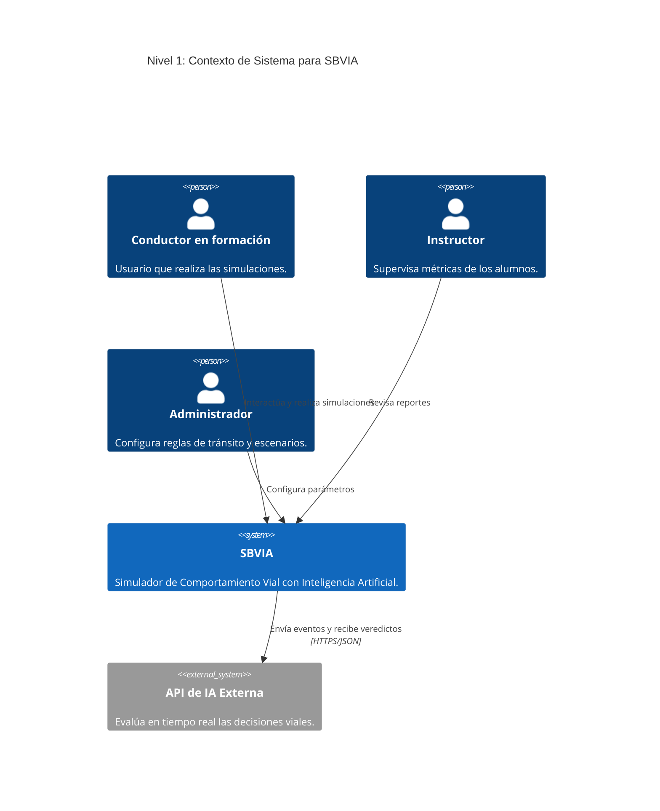
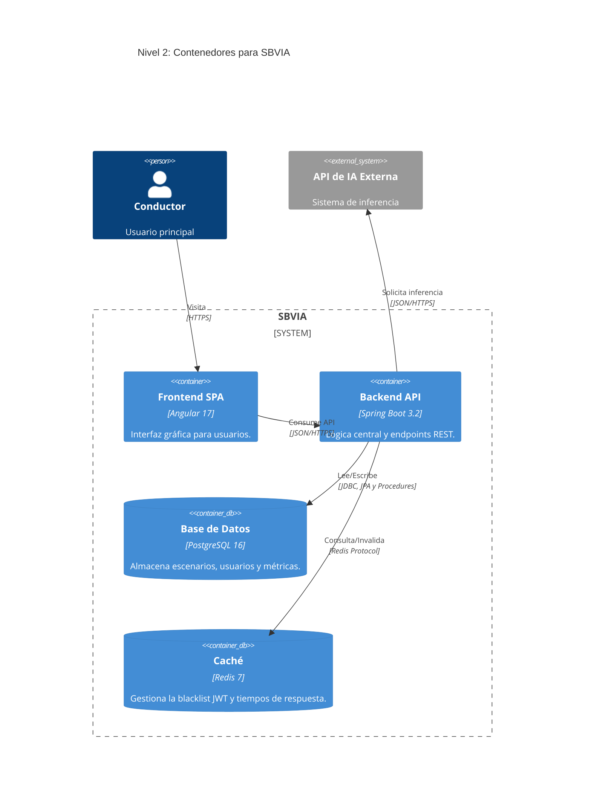
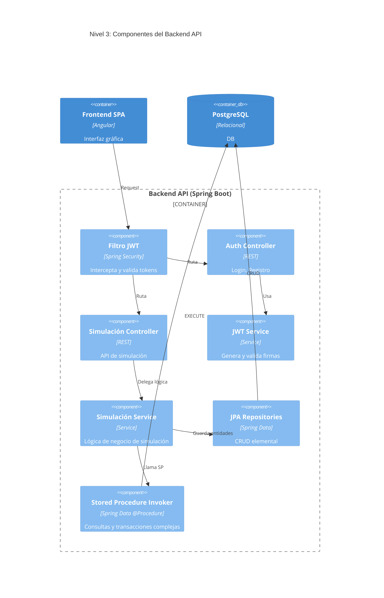

# Diagramas C4 - SBVIA

Como fue solicitado, a continuación se incluyen las representaciones en Mermaid de los diagramas C4 correspondientes a los Niveles 1, 2 y 3.

## Nivel 1: Contexto (Context)

## Nivel 2: Contenedores (Containers)

## Nivel 3: Componentes (Components - Backend)

